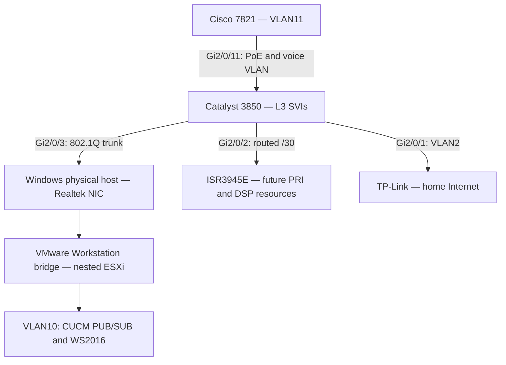

# Registering PRI Phone and uploading Latest Firmware Troubleshooting

## Cisco 7821 SIP registration, firmware installation, and a packet-size failure in a nested CUCM lab

A physical Cisco CP-7821-K9 V04 received a DHCP address, downloaded configuration, upgraded its firmware, and still remained on **Registering**. Small pings and the SIP TCP handshake worked. Packet analysis exposed missing TCP bytes, and extended pings reproduced a size-dependent failure. After changing the physical Windows host's Realtek **Jumbo Frame** setting from **Disabled** to **4088 Bytes**, the owner reported successful phone registration.

This is a real lab walkthrough, verified on October 4, 2026. It separates observed evidence from hypotheses and includes commands, expected results, and rollback.

**Terminology:** the 7821 is a SIP IP phone. PRI terminates on a voice gateway such as the ISR3945E; the phone is being prepared for a future PRI calling and transcoding lab. This guide completes phone registration, not PRI controller, dial-peer, or DSP configuration.

The actual phone MAC, screenshots containing its identity, signed device configurations, and packet captures are deliberately excluded. Examples use the fictional MAC `00:11:22:33:44:55` and device name `SEP001122334455`. Replace both with your own values. Do not publish credentials or unredacted captures.

## Contents

1. [Topology and addressing](#topology-and-addressing)
2. [Switch port and voice VLAN](#switch-port-and-voice-vlan)
3. [DHCP, DNS, and configuration discovery](#dhcp-dns-and-configuration-discovery)
4. [Firmware choice and SFTP staging](#firmware-choice-and-sftp-staging)
5. [Install firmware on CUCM](#install-firmware-on-cucm)
6. [Create the phone and line](#create-the-phone-and-line)
7. [Troubleshooting in order](#troubleshooting-in-order)
8. [Capture, export, and inspect packets](#capture-export-and-inspect-packets)
9. [Prove the packet-size failure](#prove-the-packet-size-failure)
10. [Inspect the host and test the fix](#inspect-the-host-and-test-the-fix)
11. [Validate, rollback, and prepare for PRI](#validate-rollback-and-prepare-for-pri)

## Topology and addressing



| Function | Address / subnet | Role |
|---|---|---|
| TP-Link LAN | `192.168.0.1/24` | Home upstream |
| Switch VLAN2 | `192.168.0.3/24` | Home/management segment |
| Nested ESXi management | `192.168.0.5/24` | Native VLAN2 on trunk; ESXi management portgroup VLAN0 |
| Switch VLAN10 | `192.168.10.1/24` | Server gateway |
| Switch VLAN11 | `192.168.11.1/24` | Physical phone gateway and DHCP relay |
| Switch VLAN20 | `192.168.20.1/24` | VM PCs / CIPC data network |
| CUCM PUB | `192.168.10.150` | `CUCM-PUB.CCIE.COLLAB` |
| CUCM SUB | `192.168.10.151` | `CUCM-SUB.CCIE.COLLAB`; powered off during this test |
| WS2016 | `192.168.10.157` | AD, DNS, and DHCP |
| Phone lease | `192.168.11.10/24` | Example observed lease; use your actual lease |
| Windows SFTP VM | `192.168.20.50` | Temporary firmware staging and capture export |
| Switch transit | `10.255.0.1/30` | Routed link to ISR |
| ISR transit | `10.255.0.2/30` | ISR Gi0/1 |
| Switch / ISR loopbacks | `10.255.255.1/32`, `10.255.255.2/32` | OSPF identities / stable routed addresses |

The switch routes between the phone and server SVIs. Phone-to-CUCM registration does not need the ISR. The ISR retained Gi0/0 `192.168.0.250/24` toward TP-Link for its existing upstream connectivity during the lab.

The workstation trunk had native VLAN2 and allowed VLANs `2,10,11,20`. ESXi server and voice portgroups used VLAN10 and VLAN11; its management portgroup remained VLAN0 to use the native, untagged network. Do not replace management VLAN0 with VLAN2 without redesigning the trunk/native mapping.

At final inspection PUB's gateway was `192.168.10.1`. Older lab configurations used the C8000v at `192.168.10.2`; always inspect the current gateway instead of assuming old settings remain valid.

## Switch port and voice VLAN

### Inspect before changing

```cisco
show vlan brief
show ip interface brief
show interfaces status
show interfaces trunk
show running-config interface GigabitEthernet2/0/11
show interfaces GigabitEthernet2/0/11 switchport
show running-config interface Vlan11
```

| Command | What it establishes |
|---|---|
| `show vlan brief` | VLAN existence and access-port membership; not a complete list of devices in each VLAN |
| `show ip interface brief` | SVI addresses and operational state |
| `show interfaces status` | Connected ports, access VLAN or trunk/routed role |
| `show interfaces trunk` | Native VLAN, allowed VLANs, and forwarding VLANs |
| Interface running configuration | Existing settings to preserve |
| `show ... switchport` | Actual access mode, access VLAN, and voice VLAN |

### Dedicated phone port used in this lab

```cisco
configure terminal
interface GigabitEthernet2/0/11
 description CP7821_SEP001122334455
 switchport mode access
 switchport voice vlan 11
 spanning-tree portfast
 power inline auto
 no shutdown
end
```

| Command | Meaning |
|---|---|
| `description` | Administrative label; does not control discovery or registration |
| `switchport mode access` | Fixes the port's mode rather than relying on dynamic trunk negotiation |
| `switchport voice vlan 11` | Advertises the voice VLAN to the phone; voice traffic uses VLAN11 |
| `spanning-tree portfast` | Allows an endpoint port to forward promptly; do not use this endpoint configuration on a switch interconnect |
| `power inline auto` | Allows PoE negotiation |
| `no shutdown` | Enables the port |

No explicit access-VLAN command was applied. Therefore **untagged traffic remained in VLAN1**, while phone voice traffic used VLAN11. Omitting an access VLAN does not eliminate the access VLAN.

VLAN20 was for VM PCs/CIPC. VLAN2 was for the home/ESXi management network. Neither was required as the access VLAN for a dedicated phone with no downstream PC. If using the phone's PC port, deliberately assign the appropriate data VLAN and policy for that PC.

### Verify power and VLAN learning

```cisco
show interfaces GigabitEthernet2/0/11 switchport
show power inline GigabitEthernet2/0/11
show cdp neighbors GigabitEthernet2/0/11 detail
show mac address-table interface GigabitEthernet2/0/11
show ip arp | include 0011.2233.4455
```

Expected: voice VLAN11, PoE operating, Cisco 7821 CDP neighbor, and a phone lease in `192.168.11.0/24`. This phone drew about 3.3 W. A MAC appearing in VLAN1 and VLAN11 can reflect untagged boot/discovery traffic followed by tagged voice traffic; it does not by itself prove duplicate devices or a VLAN fault.

To inventory VLAN endpoints, combine `show mac address-table vlan 11`, ARP, CDP/LLDP, DHCP leases, and ESXi portgroup mappings. MAC learning alone does not identify every IP or every powered-off VM.

## DHCP, DNS, and configuration discovery

The relay configuration was:

```cisco
interface Vlan11
 description PHYSICAL_VOICE_PHONES
 ip address 192.168.11.1 255.255.255.0
 ip helper-address 192.168.10.157
```

`ip helper-address` forwards DHCP requests to WS2016. It does **not** set the phone's TFTP address and does not register the phone.

In WS2016 DHCP, inspect the active scope for `192.168.11.0/24`:

| Scope setting | Value |
|---|---|
| Subnet mask | `255.255.255.0` |
| Option003 Router | `192.168.11.1` |
| Option006 DNS | `192.168.10.157` |
| Option015 Domain | `CCIE.COLLAB` |
| Option150 TFTP servers | `192.168.10.150`; add `.151` only when its TFTP service and files are ready |

If Option150 is absent, define it as an **IP Address array** in DHCP's predefined options, then assign it to the voice scope. The test phone already displayed PUB and SUB. Prefer only the working primary during isolated testing; restoring the secondary requires verifying it first.

Check leases and options from WS2016 PowerShell, with the DHCP module installed:

```powershell
Get-DhcpServerv4Scope
Get-DhcpServerv4OptionValue -ScopeId 192.168.11.0
Get-DhcpServerv4Lease -ScopeId 192.168.11.0 |
    Format-Table IPAddress, HostName, ClientId, AddressState
```

On the phone, inspect Applications / Settings → Admin Settings → Network Setup → IPv4 Setup. Menu wording varies by load. Verify DHCP, IP, mask, gateway, DNS, operational VLAN, and TFTP1. The tested values were phone `.11.10`, gateway `.11.1`, DNS `.10.157`, operational VLAN11, TFTP1 `.10.150`.

```powershell
nslookup CUCM-PUB.CCIE.COLLAB 192.168.10.157
nslookup CUCM-SUB.CCIE.COLLAB 192.168.10.157
```

Expected answers: `.10.150` and `.10.151`. These are PC tests; packet capture later proved the phone's own DNS queries succeeded too.

**Discovery sequence:** PoE/link → voice VLAN → DHCP → DNS as needed → trust/configuration download → firmware load if requested → SIP connection and registration. Option150 identifies a configuration server; the downloaded configuration identifies the call managers. The observed configuration transfer used **HTTP TCP 6970**, despite the server being called TFTP in phone settings.

## Firmware choice and SFTP staging

Tested enterprise SIP release: **14.4(1)SR3**, Cisco release notes dated July 2, 2026. Installed load: `sip78xx.14-4-1-0301-6`. Earlier active load: `sip78xx.14-0-1-0001-135.loads`.

| Download | Use |
|---|---|
| `cmterm-78xx.14-4-1-0301-6.k4.cop.sha512` | Signed CUCM installation package; used here |
| `cmterm-78xx.14-4-1-0301-6.zip` | Standalone firmware files for a supported manual distribution workflow |

Use enterprise SIP software appropriate to your model, hardware revision, CUCM version, device package, and release advisories. Check Cisco's download page when deploying; this guide's tested build is not a promise of the newest future release. Cisco's SR3 notes require the appropriate device package and firmware installation across the cluster. Read the package README for its exact activation/service instructions.

Keep the **COP intact** for CUCM installation. Do not rename `.sha512`, extract it as a ZIP, or feed its extracted contents to a desktop TFTP server.

The firmware staging direction is **CUCM → Windows SFTP server**, where CUCM pulls the package. WinSCP is a client; it can test SFTP or move files, but installing WinSCP alone does not provide an SFTP server. TFTPD64 is a TFTP tool and is not the SFTP source for CUCM's software installer. The switch forwards packets; it does not push a COP package into the phone.

### Windows OpenSSH server

On the staging Windows machine, run Administrator PowerShell:

```powershell
Get-WindowsCapability -Online -Name OpenSSH.Server*
Add-WindowsCapability -Online -Name OpenSSH.Server~~~~0.0.1.0
Start-Service sshd
Get-Service sshd
Get-NetFirewallRule -Name OpenSSH-Server-In-TCP
Test-NetConnection 127.0.0.1 -Port 22
whoami
```

| Command | Purpose |
|---|---|
| `Get-WindowsCapability` | Checks whether OpenSSH Server is installed |
| `Add-WindowsCapability` | Installs it if missing; Windows component availability depends on OS/build |
| `Start-Service sshd` | Starts the SSH/SFTP server |
| `Get-Service` | Confirms Running |
| Firewall-rule query | Confirms the inbound SSH rule exists and is enabled |
| Loopback TCP22 test | Verifies the local listener, not remote reachability |
| `whoami` | Identifies the actual Windows account |

If the SSH firewall rule is absent, create one scoped to the lab clients that need it:

```powershell
New-NetFirewallRule -Name OpenSSH-Lab-SFTP -DisplayName 'OpenSSH Lab SFTP' `
    -Direction Inbound -Action Allow -Protocol TCP -LocalPort 22 `
    -RemoteAddress 192.168.10.150,192.168.10.151
```

Use the Windows account password, not a Windows Hello PIN. Place the intact COP in that account's Downloads folder. In examples below the staging account is `admin`; substitute your own account.

Test from another reachable Windows machine:

```powershell
Test-NetConnection 192.168.20.50 -Port 22
```

A successful local loopback connection is insufficient: CUCM must reach the machine's actual IP. `127.0.0.1` entered on CUCM means CUCM itself, not your Windows server.

## Install firmware on CUCM

1. Open **Cisco Unified OS Administration → Software Upgrades → Install/Upgrade** on PUB.
2. Select a remote source using **SFTP**.
3. Enter server `192.168.20.50`, account `admin`, its password, and directory **`/Users/admin/Downloads`** for the Windows OpenSSH setup used here.
4. Select the intact COP package. Choose the option to continue with installation after download when appropriate; confirm the selected item is the phone firmware COP, not a CUCM platform upgrade.
5. Wait for the install result to reach **Complete**. Follow the package README's post-install instructions. Do not repeatedly reinstall a successful package just because registration is failing.
6. In **CUCM Administration → Device → Device Settings → Device Defaults**, find **Cisco 7821** and verify the intended load.
7. Complete the corresponding installation on the other cluster nodes as Cisco directs before relying on them. SUB was off during this isolated PUB test; this was not a completed cluster-wide deployment.

The directory **`/Users/admin/Downloads`** worked in this environment. These failed:

```text
/C:/Users/admin/Downloads/
Downloads
```

Do not assume every SFTP server exposes the same directory namespace. Verify the account's directory through an SFTP client and use the path CUCM accepts.

### Diagnose installer failures instead of guessing

CUCM CLI:

```cisco
file list install * detail
file view install upgrade-results.xml
```

These list installer logs and expose the actual result. In this case the XML explicitly reported the supplied directory was not in the correct format. Inspect the latest dated install log identified by the list if the XML is insufficient:

```text
file view install <exact-log-filename-from-the-list>
```

On Windows:

```powershell
Get-WinEvent -LogName 'OpenSSH/Operational' -MaxEvents 30 |
    Select-Object TimeCreated, Id, Message |
    Format-List
```

An `Accepted password` entry from PUB proves successful SSH authentication. It does not prove a correct directory, completed transfer, or successful COP installation. An installer disconnect is not automatically a network fault.

Do not attempt to upload into arbitrary CUCM filesystem directories with WinSCP. Use the supported installer and its remote SFTP source.

## Create the phone and line

For a reproducible manual registration:

1. **Device → Phone → Add New → Cisco 7821**, protocol **SIP**.
2. Enter your phone's real MAC locally. CUCM derives `SEP<12 hexadecimal digits>` without separators.
3. Select the intended device pool, CUCM group through that pool, phone button template, standard SIP profile, and a matching **Cisco 7821 nonsecure SIP security profile** for this initial test.
4. Leave **Phone Load Name blank** to inherit Device Defaults, or explicitly enter a valid installed load for a controlled per-phone upgrade. `PRI` is a description, not a firmware load name.
5. Save. Add line 1: DN `2104` if unused, partition `PT-HQ-INTERNAL`, CSS `CSS-HQ-INTERNAL`, and label `7821 PRI LAB`, provided these objects exist in your lab.
6. Save the line and use **Apply Config → Reset** for this phone when needed.

The test used device pool `DP-HQ-INDIA` and CUCM group `CMG-HQ-LAB` with PUB first and SUB second. With SUB off, PUB must actually run CallManager and be a valid registration target.

Auto-registration is a separate feature requiring correct node settings, SIP auto-registration protocol, numbering range, and policy. It is not enabled by merely configuring a voice VLAN. A **Default Device Profile** is associated with device-profile/Extension Mobility behavior; creating one is not the fix for an already manually created physical phone that cannot complete registration.

Partitions and CSS govern call routing after registration; changing them does not repair missing TCP data. A firmware upgrade and SIP registration are separate milestones. Firmware can download before successful registration, and working firmware alone does not establish call-processing connectivity.

## Troubleshooting in order

| Layer / milestone | Verify | Interpretation / next action |
|---|---|---|
| Link / PoE | Power inline, interface status, CDP | Resolve power/link first |
| Voice VLAN | Operational VLAN11 on phone; switch voice VLAN11 | Access VLAN1 remaining is not automatically a fault |
| DHCP | Correct IP/mask/gateway and WS lease | IP alone does not prove Option150 is correct |
| DNS | Phone queries/answers and FQDN records | Resolve missing forward records used by configuration |
| Reachability | Source-aware ping both ways | Small ICMP does not prove large packets or TCP application traffic work |
| Trust | ITL/CTL issuer identities and phone status | Old-cluster trust can prevent acceptance of new configuration |
| Configuration | HTTP/TFTP request and successful complete transfer | A 200 response alone is insufficient without body delivery |
| Firmware | Phone Information → Active Load | Confirms the running load, not just COP installation |
| Call processing | PUB CallManager service; valid CUCM group/security profile | TFTP can run while CallManager is unavailable |
| SIP | Complete REGISTER and corresponding response | Diagnose actual SIP responses; do not mistake alarm text for a live exchange |

Useful connectivity commands:

```cisco
! On switch
ping 192.168.10.150 source 192.168.11.1
show ip arp | include 0011.2233.4455
show cdp neighbors GigabitEthernet2/0/11 detail
! On PUB
utils network ping 192.168.11.10
utils network ping 192.168.11.1
utils service list
show network eth0
```

Inspect **Cisco CallManager** and **Cisco TFTP** specifically; a general assertion that services are running is not enough. `show network eth0` displayed PUB's gateway/DNS but did not display MTU in this test.

### Old-cluster trust was a separate problem

The used phone initially contained trust entries belonging to a previous cluster. After confirming the mismatch, its **Security Settings reset** was performed from the phone's administrative Reset Settings menu. The new lab's trust entries then appeared, configuration downloaded, and firmware upgraded.

Use the model/release administration guide for the exact menu. Security reset removes trust/security state and should be used for a verified migration/trust mismatch, not as a reflex for every registration failure. Do not confuse it with an all-settings factory reset. No cluster-wide trust or Mixed Mode change was required in this case.

`No Trust List Installed` is a status message to interpret in context. An old timestamp, disabled 802.1X, or disabled OAuth by itself is not proof of the registration failure. After trust and firmware were corrected, the size-dependent TCP issue still remained.

## Capture, export, and inspect packets

### PUB capture

Start on PUB, then restart only the test phone to reproduce boot and registration:

```cisco
utils network capture eth0 file phone7821_test count 100000 size all host ip 192.168.11.10
```

| Argument | Meaning |
|---|---|
| `eth0` | Capture interface |
| `file phone7821_test` | Output basename |
| `count 100000` | Maximum packet count |
| `size all` | Capture full packet data |
| `host ip ...` | Filter traffic involving the phone IP |

The command can remain quiet while recording. After approximately two minutes, press **Ctrl+C**. Reusing a basename can rename earlier captures with numeric suffixes; inspect filenames rather than assuming which is newest.

```cisco
file list activelog platform/cli/phone7821* detail
file get activelog platform/cli/phone7821_test.cap
```

The first command shows capture sizes/timestamps. A 24-byte classic PCAP contains only its header: zero packets. The second exports through SFTP. Enter the actual staging server IP `.20.50`, port 22, username/password, and the tested directory `/Users/admin/Downloads`.

CUCM may create subdirectories at the destination. Locate the file on Windows:

```powershell
Get-ChildItem 'C:\Users\admin\Downloads' -Recurse -Filter 'phone7821*.cap' |
    Select-Object FullName, Length, LastWriteTime
explorer.exe C:\Users\admin\Downloads
```

Open the exported `.cap` directly in Wireshark. It is a packet capture, not an image or trust-list file. These capture files are not included in this repository.

### Optional physical switch SPAN

This needs a separate capture PC or a spare physical adapter. A VM's virtual NIC is not a substitute for a cable connected to the SPAN destination.

```cisco
show monitor session all
show interfaces status
show running-config interface GigabitEthernet2/0/12
```

Only if session1 and Gi2/0/12 are free:

```cisco
configure terminal
monitor session 1 source interface GigabitEthernet2/0/11 both
monitor session 1 destination interface GigabitEthernet2/0/12
end
show monitor session 1
```

`both` mirrors both directions at the phone port; Gi2/0/12 delivers copies to Wireshark. The destination does not provide ordinary forwarding. `Ingress: Disabled` is expected. The default native encapsulation produces untagged mirrored output; packet comparison does not require preserving the VLAN tag.

Keep the VMware/ESXi host NIC on Gi2/0/3. Start Wireshark on the separate adapter attached to Gi2/0/12, with promiscuous mode enabled and no capture filter. Run PUB's capture simultaneously, restart the test phone once, stop both, and save `.pcapng` plus PUB's `.cap`.

The attempted PC capture in this incident contained host↔ESXi and unrelated Internet traffic. It was not a validated isolated phone-port SPAN capture; therefore absence of packets there could not locate the loss at the phone port.

Cleanup:

```cisco
configure terminal
no monitor session 1
end
```

Do not remove an unrelated session or save temporary capture configuration unnecessarily.

### Wireshark display filters and fields

```wireshark
ip.addr == 192.168.11.10
```

```wireshark
ip.addr == 192.168.11.10 && tcp.port == 5060
```

```wireshark
ip.addr == 192.168.11.10 && tcp.port == 6970
```

```wireshark
dns && ip.addr == 192.168.11.10
```

```wireshark
ip.addr == 192.168.11.10 &&
(ip.flags.mf == 1 || ip.frag_offset > 0)
```

```wireshark
ip.addr == 192.168.11.10 &&
(tcp.analysis.lost_segment || tcp.analysis.retransmission || tcp.analysis.duplicate_ack)
```

Use **Follow → TCP Stream** on the relevant connection, and inspect `tcp.seq`, `tcp.ack`, `tcp.len`, `tcp.options.sack_le`, `tcp.options.sack_re`, `ip.len`, `ip.flags.df`, `ip.flags.mf`, and `ip.frag_offset`. Wireshark commonly displays relative sequence numbers; use the raw sequence/acknowledgment fields or disable relative numbering when comparing raw values across files. Capture loss can trigger analysis warnings, so examine receiver ACK/SACK behavior as corroborating evidence.

Observed sequence:

| Stage | Packet evidence |
|---|---|
| DNS | Successful PUB/SUB forward queries |
| Trust | CTL and ITL requests, HTTP 200, body transfers and ACKs |
| Configuration | `SEP001122334455.cnf.xml.sgn` request, HTTP 200, completed body |
| Phone settings | DN 2104, PUB/SUB targets, and intended 14.4 load in configuration |
| Softkeys | Signed softkey configuration downloaded |
| Signaling | SYN → SYN/ACK → ACK to PUB TCP 5060 |
| Failure | Later phone data arrives with gaps; PUB's cumulative ACK does not advance and SACK identifies later received blocks |

An alarm XML string containing `Sent:REGISTER ...` is historical diagnostic text. It is not itself a complete on-wire SIP REGISTER. The pre-fix files did not show a complete registration transaction or a SIP rejection that explained the failure.

### The exact TCP gap calculation

One observed connection had:

| Event | Sequence / length |
|---|---|
| Handshake complete | PUB expects phone byte `2803081104` |
| First captured payload | Starts `2803082552`, length 112 |
| PUB ACK | Remains `2803081104`; SACK reports later block |
| Second captured payload | Starts `2803084112`, length 1165 |
| PUB ACK | Still `2803081104`; SACK reports both later blocks |

```text
First gap = 2803082552 - 2803081104 = 1448 bytes
Second gap = 2803084112 - (2803082552 + 112) = 1448 bytes
```

The same pattern repeated across multiple connections. PUB's SACKs confirmed noncontiguous receipt at its TCP stack rather than merely a Wireshark decoding warning.

The captured phone data used 20-byte IPv4 and 32-byte TCP headers. Thus a candidate full-sized segment is:

```text
1448 data + 32 TCP header + 20 IPv4 header = 1500-byte IP packet
```

The missing packets cannot have their original headers inspected. This arithmetic made a full-size packet problem a hypothesis, not proof of their exact headers or drop location.

**Fragmentation:** observed phone payload packets had DF=0, MF=0, offset=0. PUB ACKs had DF=1, MF=0, offset=0. No phone-related IP fragments appeared. DF=0 permits fragmentation; it does not mean fragmentation occurred. Identify fragments by MF=1 or a nonzero offset. TCP segmentation and IP fragmentation are different mechanisms.

## Prove the packet-size failure

Inspect the switch first:

```cisco
show interfaces GigabitEthernet2/0/11 counters errors
show interfaces GigabitEthernet2/0/3 counters errors
show interfaces GigabitEthernet2/0/3 | include MTU|error|drop|giant
show ip interface Vlan11
show ip interface Vlan10
show access-lists
```

The phone port and workstation uplink showed zero relevant error/discard counters; MTU was1500. Neither SVI had an inbound/outbound IP ACL or policy routing. Clean counters do not exclude all forwarding or downstream driver drops.

Run source-aware extended pings:

```cisco
ping 192.168.10.150 source 192.168.11.1 size 100 df-bit
ping 192.168.10.150 source 192.168.11.1 size 1400 df-bit
ping 192.168.10.150 source 192.168.11.1 size 1472 df-bit
ping 192.168.10.150 source 192.168.11.1 size 1492 df-bit
ping 192.168.10.150 source 192.168.11.1 size 1496 df-bit
ping 192.168.10.150 source 192.168.11.1 size 1500 df-bit
ping 192.168.10.150 source 192.168.10.1 size 1500 df-bit
```

In IOS, `size` is the IP datagram size. Do not confuse it with Windows `ping -l`, which specifies ICMP data size. For Windows IPv4 without options, `ping -f -l 1472 <IP>` tests a 1500-byte IP packet.

If shorthand is unsupported, enter `ping` and use:

| Prompt | Answer |
|---|---|
| Protocol | Enter for IP |
| Target | `192.168.10.150` |
| Repeat | 5 |
| Datagram size | Requested IP size |
| Timeout | 2 |
| Extended commands | y |
| Ingress ping | Enter for no |
| Source | `192.168.11.1` or `.10.1` |
| DSCP / ToS | Default |
| Set DF | yes |
| Validate / pattern / extra options | Default |
| Sweep | no |

### Observed results before the fix

| Source | IP size | Result |
|---|---:|---|
| VLAN11 SVI | 100, 1400, 1472, 1492, 1496 | Each 5/5 replies |
| VLAN11 SVI | 1500 | 0/5 |
| VLAN10 SVI | 1500 | 0/5 |

The 1497 probe was requested, but its switch result was not supplied. Do not claim an exact maximum solely from these tests: the proven passing point is 1496 and the proven failing point is 1500.

Failure sourced from VLAN10 reproduced the issue without the phone link, VLAN11 routing, or ISR. It narrowed attention to the server-facing path.

### Capture the boundary at PUB

```cisco
utils network capture eth0 file mtu_boundary count 1000 size all host ip 192.168.10.1
```

While active, run on the switch:

```cisco
ping 192.168.10.150 source 192.168.10.1 size 1496 df-bit
ping 192.168.10.150 source 192.168.10.1 size 1497 df-bit
ping 192.168.10.150 source 192.168.10.1 size 1500 df-bit
```

Stop with Ctrl+C and export:

```cisco
file get activelog platform/cli/mtu_boundary.cap
```

In Wireshark:

```wireshark
icmp && ip.addr == 192.168.10.1
```

The provided file contained five 1,496-byte Echo Requests and five corresponding replies, with no 1,497/1,500 requests. Provided those larger probes ran during the capture, loss occurred **before PUB's capture point**, rather than PUB receiving them and refusing an Echo Reply. The file alone does not prove the missing probes were sent; correlate it with switch output and capture timing.

## Inspect the host and test the fix

### Make sure you are on the correct Windows machine

Run these on the physical PC hosting VMware Workstation:

```powershell
Get-NetAdapter |
    Format-Table Name, InterfaceDescription, Status, LinkSpeed
Get-NetIPInterface -AddressFamily IPv4 |
    Format-Table InterfaceAlias, NlMtu, ConnectionState
Get-NetAdapterAdvancedProperty -Name '*' |
    Format-Table Name, DisplayName, DisplayValue -AutoSize
```

The physical host showed **Ethernet — Realtek PCIe GbE Family Controller**, IP MTU 1500. A separate Windows VM showed **Ethernet0 — vmxnet3**, IP MTU 1496. The VM's setting did not prove the physical NIC's setting or PUB's setting. An adapter-name error is resolved by listing adapters and using the exact name on that machine.

Read the relevant Realtek option and valid choices:

```powershell
Get-NetAdapterAdvancedProperty -Name 'Ethernet' |
    Where-Object DisplayName -eq 'Jumbo Frame' |
    Format-List DisplayName, DisplayValue, RegistryKeyword,
                RegistryValue, ValidDisplayValues, ValidRegistryValues
```

Observed driver options:

| Display value | Registry value |
|---|---:|
| Disabled | 1514 |
| 4088 Bytes | 4088 |
| 9014 Bytes | 9014 |

Other relevant host settings were Priority & VLAN Disabled and VLAN ID 0. Preserve the working VLAN/bridge configuration during this one-variable test.

ESXi SSH checks:

```bash
esxcli network nic list
esxcli network vswitch standard list
```

Nested ESXi vmnic0 used nvmxnet3 and MTU 1500; vSwitch0 also used MTU 1500. These read-only commands show the uplink driver/link and vSwitch/portgroup layout.

### Controlled Realtek frame-size test

Perform locally in **Administrator PowerShell on the physical host**. Applying an advanced property can restart the adapter and briefly interrupt the entire nested lab and its SSH sessions. Use the local desktop/console and retain the rollback command.

```powershell
Set-NetAdapterAdvancedProperty -Name 'Ethernet' `
    -DisplayName 'Jumbo Frame' -DisplayValue '4088 Bytes'
```

This increases the NIC driver's configured frame allowance. It does not intentionally change Windows IP MTU, ESXi MTU, switch MTU, or the phone's MTU. The purpose is to test whether ordinary 1,500-byte IP traffic carried with VLAN overhead was hitting a receive/frame handling limit. The exact accounting of1514 is driver-specific; the four-byte failure pattern is consistent with VLAN-tag overhead, not a universal proof of a Realtek hardware defect.

Verify after the adapter reconnects:

```powershell
Get-NetAdapterAdvancedProperty -Name 'Ethernet' |
    Where-Object DisplayName -eq 'Jumbo Frame' |
    Format-List DisplayName, DisplayValue
Get-NetIPInterface -InterfaceAlias 'Ethernet' -AddressFamily IPv4 |
    Format-Table InterfaceAlias, NlMtu
```

Expected configured option 4088 Bytes and IP MTU 1500. Do not copy this value blindly to another NIC: inspect its supported values first.

Retest from the switch:

```cisco
ping 192.168.10.150 source 192.168.10.1 size 1500 df-bit
ping 192.168.10.150 source 192.168.11.1 size 1500 df-bit
```

If both pass, restart only the test phone once and check registration. **The owner reported successful phone registration following the proposed change.** Post-change ping output and a successful SIP capture were not supplied with that report; obtain them to complete packet-level verification. This is an observed lab resolution, not a universal production prescription.

If the change does not help, restore the original setting:

```powershell
Set-NetAdapterAdvancedProperty -Name 'Ethernet' `
    -DisplayName 'Jumbo Frame' -DisplayValue 'Disabled'
```

Do not simultaneously modify offloads, switch MTUs, VLAN tagging, VMware bridge bindings, and CUCM settings. Otherwise success cannot be attributed to a particular change. Reducing MTU/MSS could mask a size limit; it was not the chosen repair here.

## Validate, rollback, and prepare for PRI

| Check | Completion evidence |
|---|---|
| Firmware | Phone Active Load shows `sip78xx.14-4-1-0301-6` |
| Registration | CUCM Device → Phone shows Registered to the expected node; DN 2104 appears on the phone |
| Packet size | Both 1,500-byte DF tests pass after the change |
| SIP | Fresh capture shows complete REGISTER and corresponding successful response; correlate Call-ID/CSeq |
| Calling | Test internal call, bidirectional audio, and hangup |
| Cluster | Install/verify matching firmware and services before restoring SUB as a dependable secondary |
| Temporary capture | Remove only the SPAN session created for the test |
| Persistence | Save intended switch config with `write memory` after verification |

Per-phase change controls:

| Phase | Change / why | Expected / verify | Failure / rollback / stop |
|---|---|---|---|
| Phone port | Advertise voice VLAN and supply PoE | VLAN11 lease/CDP/PoE | Restore recorded port config if wrong VLAN/link; stop before CUCM changes |
| DHCP | Scope options / relay | Correct gateway/DNS/TFTP | Restore recorded options; stop if lease/config discovery fails |
| Firmware | Signed supported COP | Complete install + requested Active Load | Use release-supported rollback only; stop for compatibility/install errors |
| Trust migration | Security reset only after verified old-cluster trust | New lab trust/config accepted | Reprovision intended cluster trust; stop before repeated resets or cluster-wide changes |
| Frame-size test | Realtek 4088, one setting |1500 tests + registration | Restore Disabled if ineffective; stop on lasting loss of host connectivity |

For future PRI/transcoding: the switch currently advertised the server subnet through OSPF to the ISR. Registration between VLAN11 and VLAN10 worked through local switch routing. When the ISR terminates media for physical phones or CIPC, ensure it has return routes to **VLAN11 and VLAN20**, not merely CUCM's VLAN10. A gateway that can signal to CUCM can still lack a route for RTP to an endpoint. Audit licenses, PRI hardware, PVDM/DSP capacity, codecs, and media-resource registration separately.

## Lessons from the incident

- A DHCP lease proves address allocation, not configuration discovery or registration.
- A successful firmware load proves that upgrade milestone, not the SIP transaction.
- A successful TCP handshake proves small handshake packets passed; it does not prove full-sized data delivery.
- Cumulative ACK plus SACK can establish missing bytes at the receiver even when packets themselves are absent.
- A1500-byte IP packet carried on a tagged Ethernet network has additional link-layer overhead; IP MTU and NIC frame allowance must not be conflated.
- Preserve what works and change one setting at a time. Packet evidence prevented repeated firmware installs and trust resets from becoming the troubleshooting strategy.

## Primary references

- [Cisco7800 firmware14.4(1)SR3 release notes](https://www.cisco.com/c/en/us/td/docs/voice_ip_comm/cuipph/7800-series/14-4-1-SR3/p2ad_b_7800-rn-1441sr3.html) — tested build, device-package prerequisites and installation instructions.
- [Cisco CUCM Security by Default / ITL troubleshooting](https://www.cisco.com/c/en/us/support/docs/voice-unified-communications/unified-communications-manager-callmanager/116232-technote-sbd-00.html) — trust behavior during migration.
- [Cisco3850 SPAN/RSPAN configuration](https://www.cisco.com/c/en/us/td/docs/switches/lan/catalyst3850/software/release/16-6/configuration_guide/nmgmt/b_166_nmgmt_3850_cg/b_166_nmgmt_3850_cg_chapter_0100.html) — physical source/destination mirror behavior.
- [Microsoft OpenSSH Server installation](https://learn.microsoft.com/en-us/windows-server/administration/openssh/openssh_install_firstuse) — SSH server/service/firewall setup.
- [Microsoft Set-NetAdapterAdvancedProperty](https://learn.microsoft.com/en-us/powershell/module/netadapter/set-netadapteradvancedproperty) — property changes and adapter restart behavior.
- [RFC2018: TCP Selective Acknowledgment](https://www.rfc-editor.org/rfc/rfc2018.html) — interpretation of receiver SACK blocks.
- [RFC791: IPv4](https://www.rfc-editor.org/rfc/rfc791.html) — DF, MF and fragment-offset semantics.

Private captures and vendor firmware binaries are not distributed here. Readers can reproduce the capture paths and tests using their own authorized lab and Cisco downloads.
